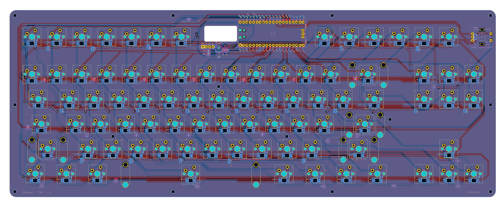

# `kb1`: a fully DIY mechanical keyboard

Features:

- Mechanically built using two PCBs and a few screws and standoffs.
- Proper "tenkeyless" layout, compatible with Cherry MX-style switches (mine with Kailh box crystal jades)
- Per-key RGB backlight using reverse-mounted SK6812 neopixels
- Featuring an old-school 16x2 character display
- And of course a _knob_ (rotary encoder)
- Based on the Raspberry Pi Pico and [KMK](https://github.com/KMKfw/kmk_firmware)

## Why?

To challenge myself and practice PCB design!

Is it tons of fun to design and build your own keyboard from scratch? Hell yeah. Would I recommend this board for daily use? Not really :^)

## PCB

See `hardware/` for the KiCad files. There is a `gerbers/` folder with ZIP files ready to upload to a PCB fab.

## Firmware

Installing:
1. Grab Circuitpython, the Adafruit Circuitpython Neopixel library, and the KMK base files
2. Copy `firmware/*.py` to your Circuitpython drive

It's just a simple KMK setup with scaffolding code for the display and RGB. Actually doing something with the display is still TBD.

As a demo there is currently a bit of logic to map individual RGB leds to keys so it can light up a key when pressed. Twisting the knob changes the overall backlight color.

## Pics

| | |
|:---:|:---:|
|||
|||
|||

## Errata / improvements for next version

Latest version: v1 (but the gerbers say v2, sorry..)

- Display pinout doesn't work well with a JST connector due to the orientation, requires manual soldering
- Pico orientation is awkward, I needed a USB type-C 90 degree adapter
- Several nuts nearly touch (covered) traces, doesn't appear to be a problem though
- The top plate could have some more copper for rigidity

## BoM

TODO

## Disclaimer 

This is my own hobby project and I'm a total PCB design newbie. Use the info and files provided here at your own risk.