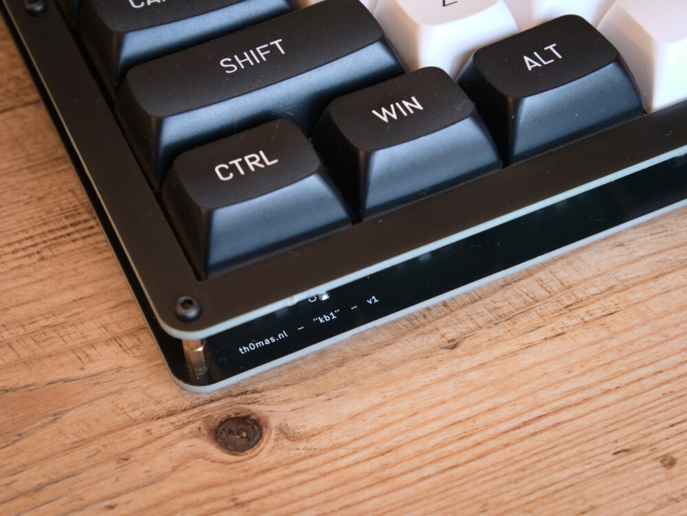

# `kb1`: a fully DIY mechanical keyboard

Features:

- Mechanically built using two PCBs and a few screws and standoffs.
- Proper "tenkeyless" layout, compatible with Cherry MX-style switches (mine with Kailh box crystal jades)
- Per-key RGB backlight using reverse-mounted SK6812 neopixels
- Featuring an old-school 16x2 character display
- An of course a _knob_ (rotary encoder)
- Based on the Raspberry Pi Pico and [KMK](https://github.com/KMKfw/kmk_firmware)

## Why?

To challenge myself and practice PCB design!

Is it tons of fun to design and build your own keyboard from scratch? Hell yeah. Would I recommend this board for daily use? Not really :^)

## Software

## Pics

| | |
|:---:|:---:|
|||
|||
|||

## Bill of materials

- TODO

## Disclaimer 

This is my own hobby project and I'm a total PCB design newbie. Use the info and files provided here at your own risk.