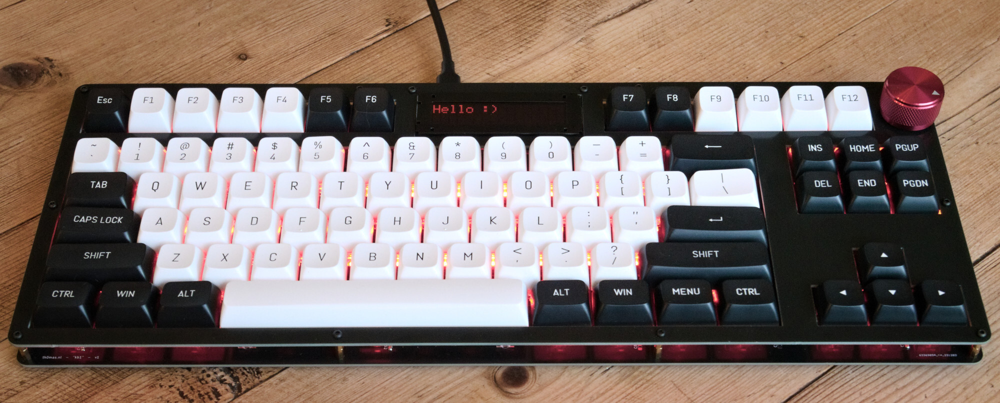
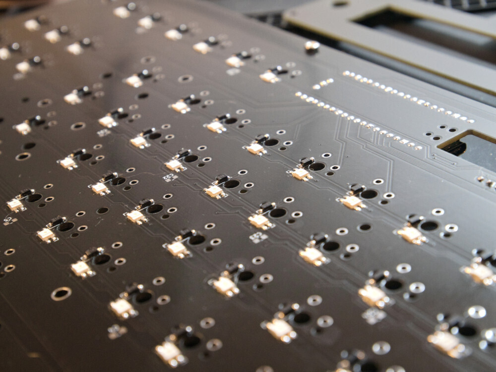
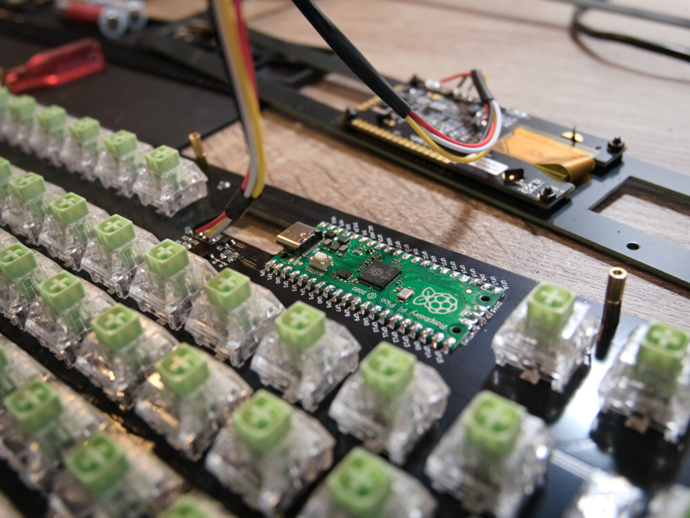
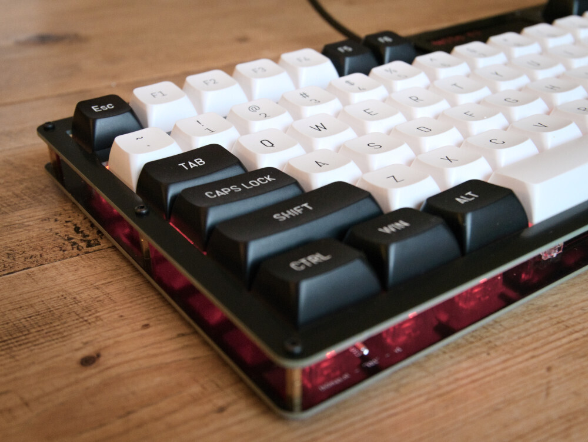
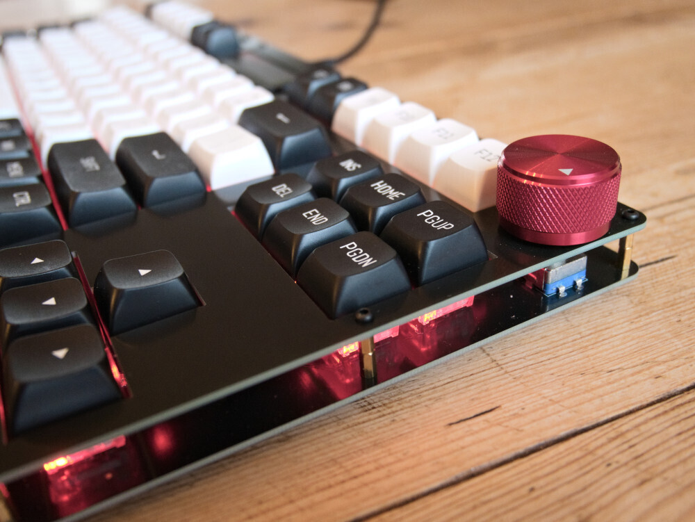
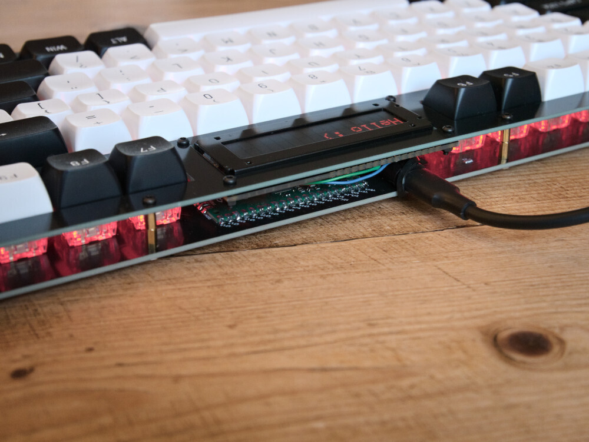

# `kb1`: a fully DIY mechanical keyboard

Features:

- Built using two PCBs and a few screws and standoffs.
- Proper "tenkeyless" layout, compatible with Cherry MX-style switches (mine with Kailh box crystal jades)
- Per-key RGB neopixel backlight
- Featuring an old-school 16x2 character display
- An of course a _knob_ (rotary encoder)
- Based on the Raspberry Pi Pico and KMK

## Why?

To challenge myself and practice PCB design!

Is it tons of fun to design and build your own keyboard from scratch? Hell yeah. Would I recommend this board for daily use? Not really :^)

## Pics

| | |
|:---:|:---:|
|||
|||
|| |

## Bill of materials

- TODO

## References

- TODO

## Disclaimer 

This is my own hobby project and I'm a total PCB design newbie. Use the info provided here at your own risk.